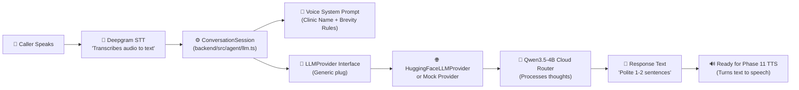

# Phase 10 Explained — Connecting the Voice Agent to LLM (Qwen3.5-4B)

Welcome to the beginner-friendly, plain-language architectural guide for **Phase 10**.

This guide explains **what we built**, **what problem it solves**, **why the folders are organized the way they are**, and **how words spoken by a caller turn into an intelligent answer**.

---

## 1. What Did We Do in Phase 10? (The 10-Second Summary)

Before Phase 10:
- Our system could listen to audio through LiveKit (Phase 5 & 6).
- It could detect when a person starts and stops speaking using Silero VAD (Phase 7).
- It could turn spoken Assamese/Hindi/English audio into written text using Deepgram Nova-3 STT (Phase 8 & 9).
- **BUT the system had no brain!** When the user said something, the agent heard it, transcribed it, and then did nothing with it.

In Phase 10:
- We gave the agent its **thinking brain** using a Large Language Model (**Qwen3.5-4B**).
- We connected the flow:
  $$\text{Spoken Audio} \longrightarrow \text{STT Text} \longrightarrow \mathbf{\text{LLM Brain (Phase 10)}} \longrightarrow \text{Response Text}$$
- We made sure the code is **not locked into Hugging Face**. In the future, if you want to switch to your own local GPU server (like vLLM or Ollama), you can do it without changing the agent's code.

---

## 2. What Part of the System Did We Solve?

Think of a voice assistant as a human receptionist:

| Part of Receptionist | Tech Equivalent | Phase |
|---|---|---|
| **Ears** (detecting voice vs silence) | Silero VAD | Phase 7 |
| **Understanding sounds into words** | Deepgram STT | Phase 8 & 9 |
| **Brain & Thinking** (understanding what the caller wants & deciding what to say) | **LLM (Qwen3.5-4B via LLMProvider)** | **Phase 10 (THIS PHASE)** |
| **Mouth & Voice** (speaking words out loud) | IndicF5 TTS | Phase 11 (Next Phase) |

Phase 10 solves the **thinking and decision-making** part:
1. It takes the text produced by Deepgram STT.
2. It sends it to the LLM.
3. The LLM understands the caller's language (Assamese, Hindi, English, or mixed).
4. The LLM crafts a polite, super-short, voice-friendly response.

---

## 3. The Full Workflow (With Real-World Examples)

### Simple Diagram of the Flow



---

### Example 1: Pure Assamese Booking Query

```text
1. Caller speaks:
   "নমস্কাৰ, মই ডাঃ বৰুৱাৰ লগত এটা এপইণ্টমেণ্ট বুক কৰিব বিচাৰো।"
   (Hello, I want to book an appointment with Dr. Baruah.)

2. STT receives audio and emits final text:
   userText = "নমস্কাৰ, মই ডাঃ বৰুৱাৰ লগত এটা এপইণ্টমেণ্ট বুক কৰিব বিচাৰো।"

3. ConversationSession feeds this to LLMProvider with the Clinic Prompt.

4. LLM realizes:
   - Language is Assamese.
   - Caller wants Dr. Baruah.
   - Missing info: What day or date?

5. LLM responds in Assamese:
   "নমস্কাৰ, আপুনি কাইলৈ কোন সময়ত ডাঃ বৰুৱাৰ ওচৰলৈ আহিব বিচাৰে অনুগ্ৰহ কৰি কওক।"
   (Hello, please let us know what time tomorrow you would like to visit Dr. Baruah.)
```

---

### Example 2: Code-Switching (Assamese Grammar + English Words)

In real life, people in Assam rarely speak 100% textbook Assamese on the phone. They mix English terms naturally:

```text
1. Caller speaks:
   "নমস্কাৰ, মোক কাইলৈ appointment book কৰিব লাগে clinic ত।"

2. STT produces:
   "নমস্কাৰ, মোক কাইলৈ appointment book কৰিব লাগে clinic ত।"

3. LLM recognizes the code-switch:
   - It doesn't switch to rigid English.
   - It doesn't speak stiff bookish Assamese.
   - It replies in natural conversational Assamese preserving the clinical context.

4. LLM responds:
   "নমস্কাৰ, কাইলৈ আমাৰ ক্লিনিকত পুৱা ১০ বজাত এপইণ্টমেণ্ট উপলব্ধ আছে।"
```

---

### Example 3: Missing Information (Incomplete Request)

Voice receptionists must never assume or hallucinate details:

```text
1. Caller speaks:
   "মোক এটা এপইণ্টমেণ্ট লাগিছিল।" (I needed an appointment.)

2. LLM notices critical missing items:
   - Who is the doctor?
   - What is the preferred date or symptom?

3. LLM asks for the missing detail instead of making up a fake booking:
   "নিশ্চয়, আপুনি কোন তাৰিখে আৰু কোনজন চিকিৎসকৰ ওচৰলৈ যাব বিচাৰে অনুগ্ৰহ কৰি কওক।"
   (Sure, please tell me which date and which doctor you would like to visit.)
```

---

### Example 4: Telephone Brevity Rule

When reading an essay, paragraphs are fine. But on a **phone call**, long paragraphs sound robotic and unbearable!

- **Bad chatbot response (unacceptable for voice):**
  > "Hello! Sure! Here are our available doctors: 1. Dr. Baruah (Cardiology), 2. Dr. Sarma (Orthopedics). Please let me know what works best for you!"
- **Good voice response (Phase 10 standard):**
  > "Hello, welcome to Brahmaputra Health Clinic. How can I assist you with your appointment today?" (1 sentence, no bullet points, no markdown asterisks).

---

## 4. Why Are There TWO `agent` Folders?

If you inspect the repository, you will notice:
1. `backend/src/components/agent/`
2. `backend/src/agent/`

Why did we do this? This is a deliberate, professional backend architectural pattern.

```text
backend/src/
│
├── components/agent/          <-- THE BUILDING BLOCKS & PROVIDERS (Domain / Logic)
│   ├── providers/
│   │   ├── stt/               <-- STT interfaces & Deepgram driver
│   │   ├── llm/               <-- LLM interfaces & Hugging Face driver
│   │   └── tts/               <-- TTS interfaces (for Phase 11)
│   └── tools/                 <-- Future business tools (Phase 15)
│
└── agent/                     <-- THE WORKER RUNTIME LOOP (Real-time LiveKit Engine)
    ├── index.ts               <-- LiveKit background process (cli.runApp)
    ├── vad.ts                 <-- Audio frame watcher (Silero ONNX)
    ├── stt.ts                 <-- WebRTC track listener (Deepgram socket)
    ├── llm.ts                 <-- Dialogue session manager (Prompt + turns)
    └── greeting.ts            <-- PCM chime synthesizer
```

### In Plain English:

- **`src/components/agent/` is the "Hardware Store" (Building Blocks):**
  - It contains the **plug specifications** (`types.ts`), the **plugs** (`HuggingFaceLLMProvider`, `DeepgramSTTProvider`), and the **factory** (`getLLMProvider`).
  - It does **not care** whether audio comes from a telephone, a browser, or a test file.
  - It could be used by a REST API endpoint, a background job, or a test script.

- **`src/agent/` is the "Live Factory" (Real-time Worker):**
  - This is the real-time LiveKit process that connects to WebSocket `ws://127.0.0.1:7880`.
  - It joins voice rooms, listens to participants' microphones, monitors VAD interruptions, and pipes STT text into the LLM.
  - It **uses** the blocks from `components/agent/`.

This separation ensures that if tomorrow you want an HTTP endpoint `/api/v1/chat` on your website, you can reuse `src/components/agent/providers/llm/` without having to launch a WebRTC voice room!

---

## 5. Files We Created and Modified in Phase 10

Here is every file involved in Phase 10 and exactly what it does:

### 1. `backend/src/components/agent/providers/llm/types.ts`
- **What it does:** Defines the "Contract" or "Interface".
- **Key concepts:**
  - `LLMMessage`: Represents a chat message (`system`, `user`, `assistant`).
  - `LLMChunk`: A small piece of text streamed back one word at a time (`delta: "Hello "`).
  - `LLMProvider`: The master interface. Any model (Hugging Face, vLLM, OpenAI, Groq) that implements `generate()` and `chat()` can be plugged in.

### 2. `backend/src/components/agent/providers/llm/config.ts`
- **What it does:** Reads settings safely from environment variables.
- **Key settings:** `HUGGINGFACE_BASE_URL` (`https://router.huggingface.co/v1`), `HUGGINGFACE_MODEL` (`Qwen/Qwen3.5-4B`), `temperature: 0.3`, `maxTokens: 256`.

### 3. `backend/src/components/agent/providers/llm/huggingface.ts`
- **What it does:** The actual connector to the cloud.
- **How it works:** It uses Node.js standard `fetch` to send a POST request to `${baseURL}/chat/completions`. When streaming, it listens to Server-Sent Events (SSE lines starting with `data: `) and emits chunks as they arrive.
- **Why no external SDK library?** Hugging Face's router uses the universal OpenAI HTTP format. Writing it with standard `fetch` means **zero third-party package dependencies** and zero vendor lock-in.

### 4. `backend/src/components/agent/providers/llm/mock.ts`
- **What it does:** The offline/test simulator.
- **Why it matters:** It lets you run tests and develop locally at **₹0** without needing internet or cloud credits. It understands test phrases in Assamese, Hindi, English, and code-switching, and splits responses into streaming chunks just like a real LLM.

### 5. `backend/src/components/agent/providers/llm/factory.ts`
- **What it does:** The "Provider Switcher".
- **How it works:** Reads `LLM_PROVIDER` from your `.env` file. If `LLM_PROVIDER=mock`, it gives you the mock. If `LLM_PROVIDER=huggingface`, it gives you the cloud model.

### 6. `backend/src/agent/llm.ts`
- **What it does:** The agent's conversation manager.
- **Key features:**
  - `createVoiceSystemPrompt(clinicName)`: Creates the system prompt parameterized by `CLINIC_NAME` from `.env`.
  - `ConversationSession`: Holds the memory of the conversation so the agent remembers what the caller said earlier in the call.
  - Measures **Time to First Token (TTFT)** (how fast the LLM starts speaking) and total turn latency.

### 7. `backend/src/agent/index.ts`
- **What it does:** The main LiveKit voice worker.
- **Phase 10 change:** We prewarmed the LLM provider on worker startup, and inside `onFinalTranscript` (when Deepgram finishes transcribing speech), we pass the text to `session.processUserUtterance()`, logging structured events:
  - `llm_generation_started`
  - `llm_response_completed`

### 8. `backend/src/lib/env.ts` & `backend/.env`
- **What it does:** Environment variable validation using Zod.
- **Added:**
  - `LLM_PROVIDER`: `"huggingface"` or `"mock"`.
  - `CLINIC_NAME`: Parameterized clinic name (`"Brahmaputra Health Clinic"` by default).

### 9. `backend/test/llm.test.ts`
- **What it does:** 9 automated tests verifying multilingual understanding, brevity, missing information handling, streaming latency, and live cloud router connectivity.

---

## 6. Glossary: Small to Big Concepts Explained

| Concept / Term | What It Means in Plain English |
|---|---|
| **LLM (Large Language Model)** | An AI neural network trained on billions of sentences (e.g., Qwen3.5-4B). It takes a list of messages and predicts what words should come next. |
| **Qwen3.5-4B** | A 4-billion parameter open-weights multilingual model created by Alibaba Cloud, known for strong performance across Asian languages including Assamese, Bengali, and Hindi. |
| **Inference Provider** | A cloud service that runs the heavy GPU hardware needed to compute LLM neural math so you don't need a ₹2,00,000 graphics card on your laptop. |
| **OpenAI-Compatible Endpoint** | An industry-standard HTTP format (`POST /v1/chat/completions`) originally invented by OpenAI, but now adopted by Hugging Face, vLLM, Ollama, Groq, and others. Any client that can talk to one can talk to all of them. |
| **Provider Abstraction** | An architectural technique where your core app only talks to an interface (`LLMProvider`), never to a specific brand. If tomorrow you switch from Hugging Face to self-hosted vLLM, you change ONE word in `.env` and zero code. |
| **Streaming & SSE (Server-Sent Events)** | Instead of waiting 3 seconds for the model to write a full paragraph, the server sends each word as soon as it's generated (`data: {"delta": "Hello"}`). This allows voice agents to start speaking immediately. |
| **TTFT (Time to First Token)** | The delay (in milliseconds) between when the user stops talking and when the very first word of the AI response arrives. Low TTFT (<300ms) makes conversations feel snappy and human. |
| **Code-Switching** | Mixing words from two languages in one sentence (e.g., Assamese grammar mixed with English words like "appointment", "clinic", "doctor"). |
| **Spoken Brevity Rule** | Instructing the model to reply in 1 to 2 short sentences without markdown symbols, bullet points, or asterisks because text-to-speech engines would otherwise read them out loud awkwardly. |
| **₹0 Local Development** | The design guarantee that a developer can check out this repository, run all unit tests, and work on features without spending money or being blocked by empty credit cards. |
| **exactOptionalPropertyTypes** | A TypeScript strict-mode compiler setting that stops you from accidentally passing `{ prop: undefined }` when a setting is meant to be completely omitted or explicitly typed with `| undefined`. |

---

## 7. What Happens Next? (Roadmap to Phase 11)

Now that Phase 10 is complete:
- **Audio in** $\rightarrow$ Silero VAD (Phase 7)
- **Audio to text** $\rightarrow$ Deepgram Nova-3 (Phase 8 & 9)
- **Text to intelligent response text** $\rightarrow$ **Qwen3.5-4B (Phase 10 — DONE)**
- **Response text to spoken Assamese audio** $\rightarrow$ **Phase 11 (IndicF5 TTS — Next up!)**

Once Phase 11 is built, we will have the **complete voice loop** where the agent can listen to Assamese speech and reply with real Assamese voice!
