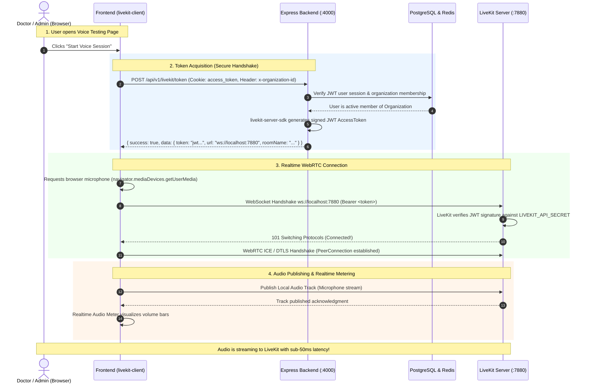

# Phase 5 — LiveKit Architecture, Server SDK & Token Flow Explained

This guide explains in simple, clear terms how **LiveKit**, the **LiveKit Server SDK**, **Access Tokens**, and **WebRTC audio** work together in Phase 5 of this platform.

---

## 1. What is LiveKit?

**LiveKit** is an open-source, high-performance **Selective Forwarding Unit (SFU)** built for WebRTC.
- In traditional web development, HTTP is used for request/response, and WebSockets are used for low-latency text messages.
- For **real-time audio and video**, you need **WebRTC** (sub-100ms latency, UDP media transport, jitter buffers, packet loss concealment, and echo cancellation).
- LiveKit acts as the central traffic controller: clients (browsers, phones, or AI workers) send their microphone audio to LiveKit, and LiveKit forwards it to whoever is subscribed in the room.

---

## 2. What is `livekit-server-sdk`?

LiveKit has two different SDKs for different environments:

| SDK | Where it runs | What it does |
|---|---|---|
| **`livekit-client`** | Browser (Frontend) | Connects to LiveKit over WebRTC, accesses user's microphone, publishes audio tracks, and plays received audio. |
| **`livekit-server-sdk`** | Node.js Backend (`apps/api`) | Manages rooms server-side and **issues signed access tokens (JWTs)** using your root API secret. |

The **LiveKit Server SDK** is a Node.js library (`npm install livekit-server-sdk`) used exclusively on the secure backend. Its two main capabilities are:

1. **`AccessToken` Generation**: Creates cryptographically signed JSON Web Tokens (JWTs) that grant specific users permission to join specific rooms with specific capabilities (e.g. publish audio, subscribe to audio).
2. **`RoomServiceClient` / Administration**: Allows your backend to programmatically inspect rooms, list participants, mute users, kick bad actors, or trigger agent workers.

---

## 3. Why Do We Need a LiveKit Token? For What Flow?

### Why can't the browser just connect directly?

LiveKit requires authentication for every single connection. To verify connection requests, LiveKit uses an **API Key** and **API Secret** (configured as `devkey` and `devsecret` in our Docker Compose).

> [!CAUTION]
> **Never put your `LIVEKIT_API_SECRET` in the browser or frontend.**
> If the frontend had the secret, any user could inspect Network tools, extract the secret, and generate admin tokens to eavesdrop on any clinic's calls, delete rooms, or hijack server bandwidth.

### Why do we need short-lived Access Tokens?

A **LiveKit Access Token** is a signed JWT. It solves four critical problems:

1. **Zero Secret Exposure**: The browser never sees the master secret. The backend holds the secret and signs a token for the user.
2. **Tenant & Room Isolation**: The token dictates *exactly which room* the user is allowed to join (e.g. `room: "clinic-voice-agent-org123"`). A user from Clinic A cannot join a call belonging to Clinic B because the token signature will fail if they tamper with the room name.
3. **Role & Permission Control (Grants)**: The token defines what the participant is allowed to do:
   - Can they publish their microphone? (`canPublish: true`)
   - Can they hear others? (`canSubscribe: true`)
   - Can they send text data messages? (`canPublishData: true`)
4. **Time-To-Live (TTL)**: Tokens expire quickly (e.g., 15 minutes). If a token is somehow intercepted, it cannot be reused later.

---

## 4. The Complete End-to-End Connection Flow (Phase 5)

Here is how everything connects together from the moment a user clicks **"Start Voice Session"** on the dashboard:



---

## 5. Step-by-Step Breakdown

### Step 1: User requests session from Dashboard
The user is logged in to the dashboard (authenticated in Phase 4). They click **Start Voice Session**. The frontend does NOT immediately call LiveKit. First, it asks our backend for permission.

### Step 2: Backend validates and signs the token
The Express backend receives `POST /api/v1/livekit/token`.
1. `auth` middleware checks the user's session cookie.
2. `requireOrganization` middleware checks that the user genuinely belongs to the active clinic organization.
3. The controller calls `createTokenService`:
   ```ts
   import { AccessToken } from "livekit-server-sdk";

   const at = new AccessToken(env.LIVEKIT_API_KEY, env.LIVEKIT_API_SECRET, {
     identity: `user-${user.id}-${Date.now().toString(36)}`,
     name: user.name,
     ttl: "15m",
     metadata: JSON.stringify({
       organizationId: org.id,
       userId: user.id,
     }),
   });

   at.addGrant({
     roomJoin: true,
     room: roomName,
     canPublish: true,
     canSubscribe: true,
     canPublishData: true,
   });

   const token = await at.toJwt();
   ```
4. Backend sends the signed JWT string back to the browser.

### Step 3: Browser connects to LiveKit
The browser's `useLivekitRoom` hook receives the token and server URL (`ws://localhost:7880`):
```ts
import { Room, RoomEvent } from "livekit-client";

const room = new Room({
  adaptiveStream: true,
  dynacast: true,
});

// Connect to LiveKit server with the JWT token
await room.connect("ws://localhost:7880", token);
```

### Step 4: Microphone capture and publishing
Once connected to the room:
1. The browser requests microphone permission:
   ```ts
   await room.localParticipant.setMicrophoneEnabled(true);
   ```
2. LiveKit captures the audio, encodes it with the **Opus** codec (optimal for speech), and sends it over UDP WebRTC to the LiveKit server.

### Step 5: Audio Visualizer
The hook listens to microphone audio levels:
```ts
room.on(RoomEvent.ActiveSpeakersChanged, (speakers) => { ... });
```
This powers the live volume meter on the UI so the user gets instant visual confirmation that their voice is being captured and transmitted.

---

## 6. What Inside a LiveKit Token? (Anatomy of the JWT)

If you decode a LiveKit JWT token on [jwt.io](https://jwt.io), here is what it looks like:

```json
// Header
{
  "alg": "HS256",
  "typ": "JWT"
}

// Payload
{
  "exp": 1728131400,            // Expiration timestamp (15 minutes from now)
  "iss": "devkey",                // LiveKit API Key
  "sub": "user-uuid-12345",       // Unique participant identity
  "name": "Dr. Uday",             // Display name
  "metadata": "{\"orgId\":\"...\"}",
  "video": {
    "room": "voice-room-org123",  // Only allowed in THIS room
    "roomJoin": true,             // Can join the room
    "canPublish": true,           // Can send microphone audio
    "canSubscribe": true,         // Can hear other participants / AI
    "canPublishData": true        // Can send data channel messages
  }
}
```

When LiveKit receives this JWT during the WebSocket handshake, it verifies the HS256 signature using its `LIVEKIT_API_SECRET`. If any attacker tries to change the `room` or `canPublish` grant, the signature becomes invalid and LiveKit immediately disconnects the connection with code `4001: Unauthorized`.

---

## 7. How Does Phase 5 Differ From Phase 6?

Understanding the separation between Phase 5 and Phase 6 is crucial:

```text
Phase 5 (Current Phase — Media Transport Only):
┌────────────────┐          WebRTC Audio          ┌─────────────────┐
│ Browser Tab A  │ ◄────────────────────────────► │ LiveKit Server  │
└────────────────┘                                └────────┬────────┘
                                                           ▲
                                                           │ WebRTC Audio
                                                  ┌────────┴────────┐
                                                  │ Browser Tab B   │ (Dual-tab verification)
                                                  └─────────────────┘
Success Condition: Browser A publishes audio to LiveKit. If Browser B joins, A & B talk in realtime.
NO AI IS INVOLVED.
```

```text
Phase 6 (Next Phase — AI Agent Worker Joins):
┌────────────────┐          WebRTC Audio          ┌─────────────────┐
│ Browser Tab A  │ ◄────────────────────────────► │ LiveKit Server  │
└────────────────┘                                └────────┬────────┘
                                                           ▲
                                                           │ WebRTC Audio Track
                                                  ┌────────┴────────┐
                                                  │ Node Agent      │ (Phase 6 Worker)
                                                  │ @livekit/agents │
                                                  └─────────────────┘
Success Condition: Browser user speaks, and the Node Agent answers back.
```

In Phase 5, we verify that:
1. Microphone permissions work smoothly across all states.
2. WebRTC connection establishes with sub-50ms latency.
3. Microphone audio is published to the room.
4. Mute / Unmute works instantly without disconnecting.
5. Opening two browser tabs connects both users to the same room, proving that two-way WebRTC audio is functioning perfectly.

---

## 8. Summary Checklist for Phase 5

| Component | Responsibility | Technology |
|---|---|---|
| **LiveKit Server** | WebRTC SFU media router | Docker container `livekit/livekit-server:latest` on port 7880 |
| **Backend Token API** | Authenticate user + org, sign JWT token | Node.js Express 5 + `livekit-server-sdk` (`POST /api/v1/livekit/token`) |
| **Frontend API Service** | Fetch token with credentials & org header | `src/services/api/livekit.ts` |
| **Frontend LiveKit Hook** | Room connection, mic tracks, audio levels | `src/hooks/use-livekit-room.ts` + `livekit-client` |
| **Frontend Voice Sandbox** | Interactive UI with volume bars, mute, ping | `src/components/voice/voice-sandbox.tsx` |
