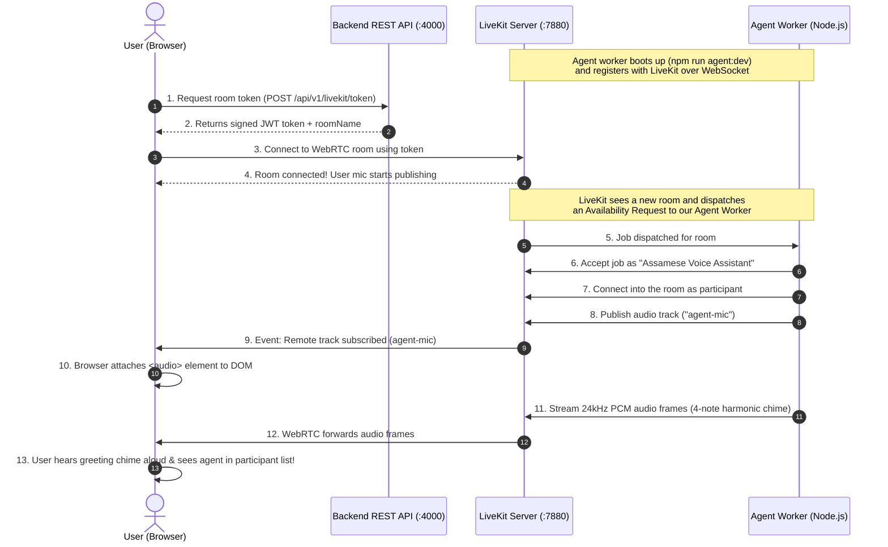

# Phase 6 — LiveKit Agent Architecture & Workflow Explained

This guide explains in simple, clear, and everyday terms what a **LiveKit Agent** is, why we need it in our voice platform, how the Phase 6 workflow works end-to-end, and what comes next in **Phase 7 (Silero VAD)**.

---

## 1. What is a LiveKit Agent in Simple Words?

Imagine a Zoom or Google Meet conference room:
- Usually, **two humans** join the meeting: you on your laptop, and a friend on their phone.
- Both of you have a **microphone** (to talk) and **speakers** (to listen).

A **LiveKit Agent** is simply a **software program running on our backend server that joins the exact same meeting as if it were a person**:
1. It enters the room with its own participant identity (`Assamese Voice Assistant`).
2. It has **virtual ears** (it receives the raw audio packets coming from your microphone over WebRTC).
3. It has a **virtual mouth / microphone** (it streams audio frames into the room so your speakers play its voice).
4. In future phases, its **brain** will be connected to STT (Speech-to-Text), LLM (Qwen AI model), and TTS (Text-to-Speech).

```text
[ Browser / Patient on Phone ]
       │            ▲
(Sends User Mic)  (Plays Agent Voice)
       ▼            │
 ┌─────────────────────────┐
 │   LiveKit Room Server   │  <── Acts like the Zoom / WebRTC switchboard
 └─────────────────────────┘
       │            ▲
(Receives User Mic) (Sends Agent Audio)
       ▼            │
[ LiveKit Agent Worker ]      <── Our Node.js software participant
```

---

## 2. Why Do We Need a Server-Side Agent? Why Not Just Call AI from the Browser?

You might wonder: *“Why don't we just call OpenAI or Deepgram directly from the React frontend in the browser?”*

There are 4 crucial reasons why a professional voice platform must use a server-side LiveKit Agent:

| Problem | Why Direct Browser AI Fails | How LiveKit Agent Solves It |
|---|---|---|
| **1. Real Phone Calls (PSTN/SIP)** | When a real patient in Assam dials our clinic's phone number from a mobile phone, **there is no browser**. They are on a cellular telecom network. | LiveKit SIP bridges the phone call directly into a LiveKit room. The server-side agent answers the phone call in the room just like it answers a browser test call. |
| **2. Security & Database Access** | Browsers cannot hold secret API keys or run PostgreSQL booking transactions directly without huge security vulnerabilities. | The Agent runs securely on our backend. It can call backend services to check doctor schedules and lock appointment slots in PostgreSQL transactions safely. |
| **3. Instant Interruption (Barge-In)** | In human conversation, if the assistant is talking and you say *"Wait, no, next Tuesday!"*, the assistant must immediately stop speaking within 100 milliseconds. | Browsers calling REST APIs can't interrupt streaming audio cleanly. LiveKit manages WebRTC media transport with sub-second interruption primitives. |
| **4. Replaceable Models for Assamese** | Browser-based AI ties you to a single vendor. | Our LiveKit Agent acts as a modular orchestrator. We can plug in **Deepgram Nova-3** for Assamese speech, **Qwen3.5-4B** for reasoning, and **AI4Bharat IndicF5** for Assamese TTS on the server without changing client code. |

---

## 3. What Was the Goal of Phase 6?

The official requirement for Phase 6 was:
> **"Browser user joins and hears a basic agent response. The agent does not need real STT/LLM/TTS yet. Use a simple deterministic greeting to prove the agent joins the room and produces output."**

### Why didn't we add real AI yet?
In systems engineering, you must **verify your pipes before turning on the water pressure**:
- If we connected STT + LLM + TTS all at once and heard silence, we would have no idea what broke: Was it microphone permissions? WebRTC ICE networking? The STT API key? The LLM prompt? Or the TTS server?
- By having the agent join the room and stream a **deterministic 4-note chime sequence** using pure linear PCM audio frames:
  1. We proved that LiveKit server dispatches rooms to our agent worker.
  2. We proved that our Node.js agent connects to WebRTC media tracks.
  3. We proved that the browser receives the audio track, attaches it to the DOM, and plays it clearly through the user's speakers.

The two-way audio bridge is now **100% verified and proven**.

---

## 4. The Complete End-to-End Workflow in Phase 6

Here is what happens behind the scenes from the moment you click **"Connect Call"**:



### Detailed Steps:
1. **Agent Standby**: Our agent worker starts up with `npm run agent:dev`. It connects to `ws://127.0.0.1:7880/agent` and registers itself as an available worker with LiveKit.
2. **User Initiates Call**: When you click "Connect Call" in the Voice Testing Lab, the frontend requests a secure token from `POST /api/v1/livekit/token`.
3. **Room Created**: The browser connects to the LiveKit server using this token.
4. **Job Dispatch**: LiveKit notices that a new room exists and immediately notifies our Agent worker.
5. **Agent Joins**: The Agent worker accepts the job, sets its display name to **"Assamese Voice Assistant"**, and joins the WebRTC room.
6. **Wait for Human**: The agent verifies that a human participant is present (`ctx.waitForParticipant()`).
7. **Audio Track Published**: The agent creates an `AudioSource(24000, 1)`, creates a `LocalAudioTrack('agent-mic')`, and publishes it to the room.
8. **Greeting Streamed**: The agent generates a 4-note harmonic chord (C5 $\rightarrow$ E5 $\rightarrow$ G5 $\rightarrow$ C6) with smooth ADSR envelope shaping, slices it into 20ms chunks (480 samples each), and streams them in realtime into LiveKit.
9. **Sound in Browser**: The browser receives the `TrackSubscribed` event, appends the audio track to an HTML `<audio>` tag, and plays the chime aloud!
10. **Clean Exit**: When you click "Disconnect", the agent detects that the participant left, cleans up its native audio memory, and goes back to standby for the next call.

---

## 5. What Was Built in the Codebase?

| File | Purpose |
|---|---|
| [`backend/src/agent/greeting.ts`](file:///d:/Projects/voice-agent/backend/src/agent/greeting.ts) | Pure procedural PCM audio synthesizer generating 24kHz 16-bit linear PCM mono frames for a pleasant 4-note chime sequence. |
| [`backend/src/agent/lifecycle.ts`](file:///d:/Projects/voice-agent/backend/src/agent/lifecycle.ts) | Structured Winston logger for all worker and session lifecycle events, plus graceful `SIGINT`/`SIGTERM` handlers. |
| [`backend/src/agent/index.ts`](file:///d:/Projects/voice-agent/backend/src/agent/index.ts) | The main agent process using `defineAgent` and `cli.runApp` with `WorkerOptions`, automatic room joining, and participant waiting. |
| [`backend/test/agent.test.ts`](file:///d:/Projects/voice-agent/backend/test/agent.test.ts) | Unit tests verifying PCM audio synthesis, 20ms frame chunking, track creation, and defineAgent structure (5/5 passed). |
| [`backend/test/agent-e2e.test.ts`](file:///d:/Projects/voice-agent/backend/test/agent-e2e.test.ts) | End-to-end integration test verifying LiveKit room dispatch, agent connection, and audio track reception by a client (1/1 passed). |

---

## 6. What Comes Next: Phase 7 — Silero VAD (Explained Simply)

Now that the agent can join the room and speak to you, the next challenge is: **How does the agent know when you are talking, and when you stop talking?**

This is the job of **Phase 7: Silero VAD**.

### What is VAD?
**VAD** stands for **Voice Activity Detection**.

In natural human conversation, there are no "Push-to-Talk" buttons:
- You don't press a button to talk like on a walkie-talkie.
- When you speak to a receptionist, they intuitively know:
  1. **When you started speaking** $\rightarrow$ they stop talking and listen.
  2. **When you pause briefly to breathe** $\rightarrow$ they wait and don't interrupt you yet.
  3. **When you have finished your sentence** $\rightarrow$ they reply.

Without VAD, an AI has no idea when a user is speaking. It would either:
- Send hours of background fan noise, coughs, and silence to expensive STT cloud APIs.
- Or interrupt you in the middle of a sentence whenever you pause for 0.2 seconds to take a breath!

### What is Silero VAD?
**Silero VAD** is a state-of-the-art, ultra-lightweight neural network designed specifically for real-time speech detection:
- It runs locally in **1 to 2 milliseconds** per audio chunk with virtually zero CPU overhead.
- It analyzes audio frames and classifies them as **Speech** or **Silence / Background Noise**.

### What will Phase 7 build?
In Phase 7, we will integrate Silero VAD into our LiveKit Agent:
1. **Speech Start Detection**: As soon as the user starts talking, the agent immediately knows speech has begun.
2. **Speech Ongoing**: Buffers incoming speech packets as long as the user continues talking.
3. **Speech End (Turn Detection)**: Detects when the user has actually stopped talking (e.g., after 500–800ms of silence), signaling that the user's turn is complete.
4. **Interruption Primitive**: If the agent is talking and the user speaks, VAD immediately signals an interruption so the agent stops audio instantly (the foundation for Phase 13 Barge-In).

### How Phase 7 sets up Phase 8 (STT):
Once VAD cleanly chops the continuous microphone stream into distinct **speech segments** (only the exact seconds where words were spoken), Phase 8 can feed those clean speech segments directly into **Deepgram Nova-3** for transcription into Assamese text!

---

## Summary Checklist

- [x] **LiveKit Server**: Running and healthy on `127.0.0.1:7880`.
- [x] **Browser Audio**: Microphone streaming and remote audio element playback verified in Phase 5.
- [x] **Agent Worker**: Built with `@livekit/agents` and `@livekit/rtc-node` in Phase 6.
- [x] **Audio Output**: 24kHz PCM harmonic greeting chime verified end-to-end.
- [x] **Testing & Verification**: 5/5 unit tests and 1/1 E2E test passing.
- [ ] **Next Step**: **Phase 7 — Silero VAD** (Speech start/end & turn detection).
